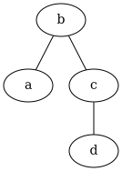
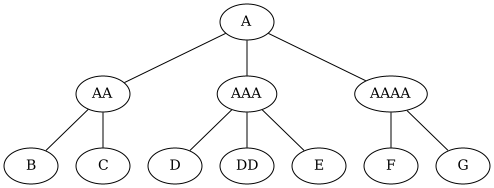
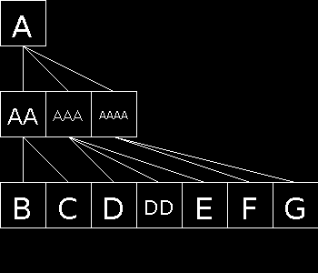
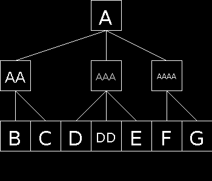

# Графический визуализатор

Задание для jetbrains-internship-2020

## Задание

Задан формат входного файла, хранящего древовидную структуру данных. Необходимо реализовать UI приложение, которое будет:

Предоставлять пользователю указать входной файл с данными
читать данные из файла
визуализировать прочитанное дерево в любых двух и более форматах в UI
Результатом выполнения задания должен быть публичный git репозиторий (на любом удобном хостинге). В репозитории должна быть настроена система сборки со всеми зависимостями, позволяющая легко собрать приложение на JDK 11.

#### Формат входного файла

Дан текстовый файл. Каждая строчка в файле представляет одну вершину дерева в виде :

    <node-name> - <parent-node-name>

Например, данный файл

    a - b
    d - c
    b
    c - b
Описывает следующее дерево:

       b
      / \
     a   c
          \
           d
Вершины в файле могут быть указаны в произвольном порядке.

Форматы UI представления дерева

Формат UI представления дерева никак не ограничен. Одним из возможных вариантов может быть ASCII-арт представление, как на примере выше.

#### Библиотеки и языки

Использование сторонних библиотек не ограничено. Единственным требованием является то, что библиотека должна корректно, автоматически выкачиваться используемой билд системой.

В качестве целевой платформы необходимо использовать Java 11. В качестве языков можно использовать
Java и Kotlin.

## Решение

Граф считывается через reader.GraphReader и хранится в классе graph.Graph

Рассмотрим два тестовых примера:

```
a - b
d - c
b
c - b
```

```
AA - A
AAA - A
A
AAAA - A
B - AA
C - AA
D - AAA
DD - AAA
E - AAA
F - AAAA
G - AAAA
```

Были реализованы четыре визуальных представлений графа.

1) С помощью библиотеки [GraphViz](https://github.com/nidi3/graphviz-java).





2) Вручную, не очень умным алгоритмом расположения 




3) Вручную, более приятным для глаз алгоритмом расположения




4) Наконец, для любителей текста, вид ASCII

```
|--b-|
|a||c|
   |d|
```

```
|----------A---------|
|-AA-||---AAA--||AAAA|
|B||C||D||DD||E||F||G|
```

Больше примеров можно посмотреть [здесь](src/main/resources).

В папке images уже есть сгенерированные файлы. Первая часть файла — название класса, второе — имя файла теста

## О запуске и системе

Пример запуска со стороны maven:

```
mvn package exec:java "-Dexec.args=--cleverclassic --input=src/main/resources/examples/3.txt --output=src/main/resources/images"
```

Флаги запуска для приложения:

--online - Онлайн отрисовка — запустится окно, в котором будет картинка. ВНИМАНИЕ! Библиотека очень нестабильна для 11 версии Java, возможны проблемы. Однако отрисовка все равно пройдет в output

--graphviz, --cleverclassic, --classic, --ascii - тип визуализатора

--input=PATH - путь до файла

--output=DIRECTORY - директория выхода, где будет создан файл с именем graph

--help - помощь.

Если не указывать флаги вообще, то пройдет тестовая отрисовка всех примеров из папки примеров

Немного примеров для запуска:

```
mvn package exec:java "-Dexec.args=--cleverclassic --input=src/main/resources/examples/3.txt --output=src/main/resources/images --help"
```

```
mvn package exec:java "-Dexec.args=--ascii --input=src/main/resources/examples/3.txt --output=src/main/resources/images"
```
